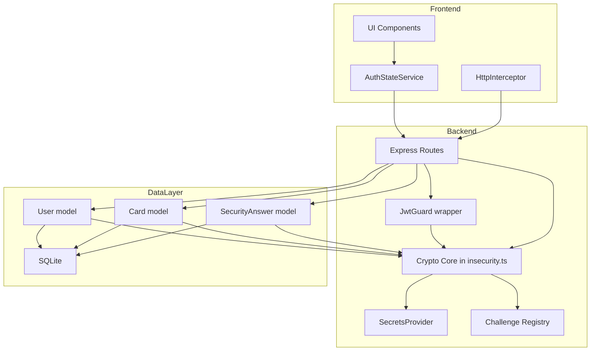
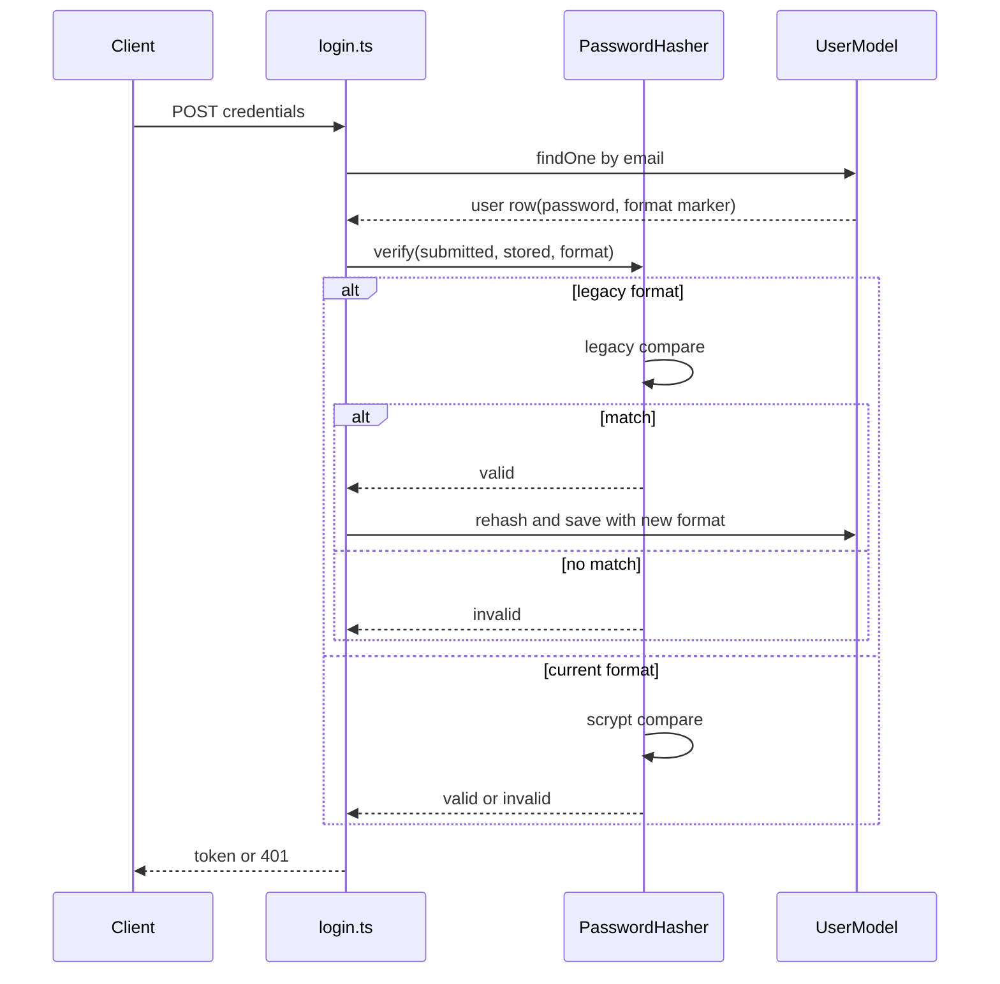
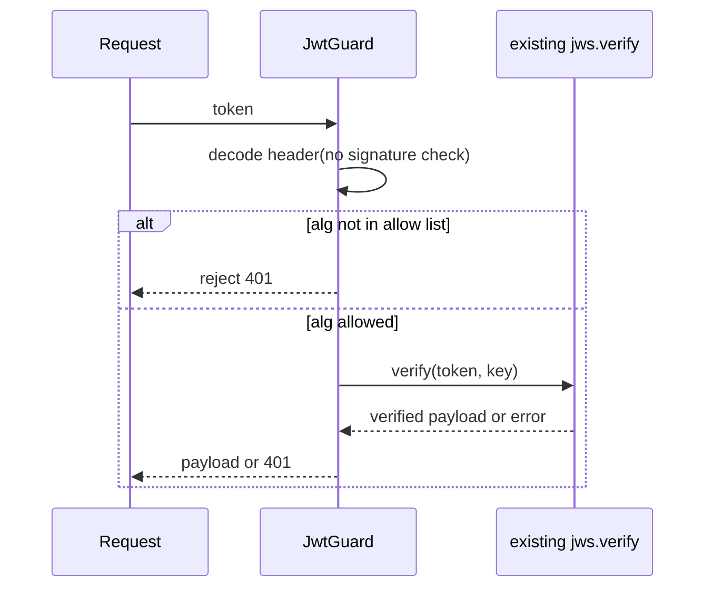
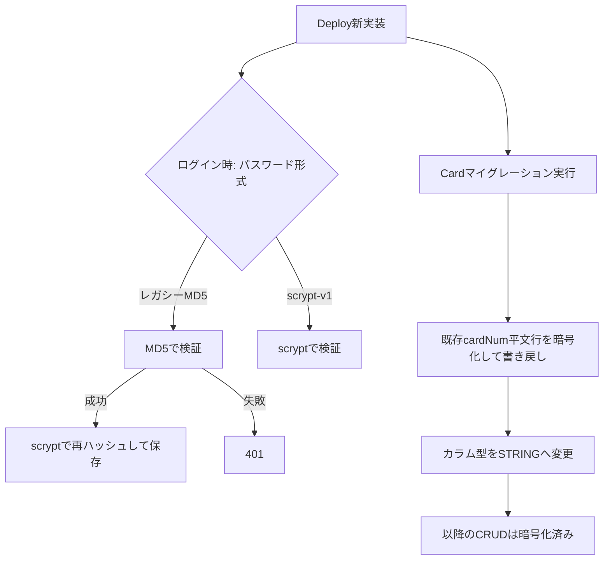

# Technical Design: a04-cryptographic-failures

## Overview

**Purpose**: 本設計は、OWASP Juice Shopのバックエンド(`lib/insecurity.ts`を中心とする認証・暗号処理)とフロントエンド(Angular側のトークン保管)に存在する、OWASP A04:2025 Cryptographic Failures該当箇所を実際に修正する。

**Users**: このアプリの保守者(セキュリティ担当者)が、CTF/学習用途としての性質を保ったまま、実運用に耐える暗号プラクティスへ置き換える。

**Impact**: `lib/insecurity.ts`・`lib/utils.ts`の暗号プリミティブ、`models/card.ts`・`models/user.ts`・`models/securityAnswer.ts`のデータ保管形式、フロントエンドの認証トークン保管方式を変更する。加えて、修正の直接的な結果として`jwtUnsignedChallenge`・`jwtForgedChallenge`の2チャレンジを意図的に無効化する。

### Goals
- MD5パスワードハッシュ・SHA-1 HMAC・ハードコード鍵・`Math.random()`・署名なしクーポン・平文機密データ・`localStorage`トークン保管の7つの脆弱パターンをすべて解消する
- 既存の依存ライブラリバージョン(`express-jwt@0.1.3`等)を変更せずに実現可能な範囲を優先し、破壊的なアップグレードは本specの範囲外として明示する
- 修正によって解答不能になるチャレンジ(`jwtUnsignedChallenge`, `jwtForgedChallenge`)を静かに壊すのではなく、明示的に無効化する

### Non-Goals
- `jsonwebtoken`/`express-jwt`/`jws`のメジャーバージョンアップグレード(Out of Boundary、将来の別specで扱う)
- `directoryListingChallenge`の既存正解コードフィックス(`data/static/codefixes/directoryListingChallenge_1_correct.ts`)の修正(A05:Security Misconfiguration領域、別specで扱う)
- CSRF対策ライブラリの具体選定(要件7の実装方針はContract止まりとし、具体的なライブラリ選定はtasksフェーズのResearch Neededとする)
- HSM/外部シークレットマネージャーとの統合(環境変数/未追跡ファイルでの鍵管理に留める)

## Boundary Commitments

### This Spec Owns
- `lib/insecurity.ts`/`lib/utils.ts`が提供する暗号プリミティブ(パスワードハッシュ、JWT署名検証、HMAC、CSPRNG、クーポン署名)の実装と、それらが利用する鍵の取得元(環境変数/未追跡ファイル)
- `models/card.ts`(`cardNum`)・`models/user.ts`(`totpSecret`)の保管時暗号化と、対応するSequelizeマイグレーション
- フロントエンドの認証トークン transport 契約(Cookie属性、ログイン状態の取得方法)の変更
- `models/challenge.ts`における`jwtUnsignedChallenge`・`jwtForgedChallenge`の無効化registrationと、`forgedCouponChallenge`/`directoryListingChallenge`との既知の非整合の明文化

### Out of Boundary
- JWT関連ライブラリ(`express-jwt`, `jsonwebtoken`, `jws`)のメジャーアップグレード自体(このspecは既存バージョンのまま`alg`事前検査ラッパーで要件を満たす)
- CSRF対策の具体的なライブラリ/実装(要件7のCookie方式への移行に伴う付随作業だが、選定はtasksフェーズに委ねる)
- `directoryListingChallenge`の正解データ修正(本specは`/encryptionkeys`一覧表示の無効化のみを行い、既存コードフィックスとの不整合はOpen Questionとして記録する)
- パスワード強度チェック・レート制限など、A04以外のOWASPカテゴリに属する改善

### Allowed Dependencies
- Node.js組込み`node:crypto`(scrypt, AES-256-GCM, randomBytes/randomInt, createHmac) — 新規npm依存なし
- 既存の`otplib`(2FA、変更なし)、`sequelize`(setter/getterパターンの拡張)
- 既存の`jws@0.2.6`/`jsonwebtoken@0.4.0`/`express-jwt@0.1.3`(バージョン固定のまま、事前検査ラッパー経由で利用)
- 既存の`ngy-cookie`(Angular) — 本specでは新規追加ではなくクライアント側書込の**削除対象**として扱う

### Revalidation Triggers
- `models/challenge.ts`の`solveIf`条件を変更する場合
- JWTペイロードの形状、または`authorize()`/`verify()`の関数シグネチャを変更する場合
- `Card`/`User`/`SecurityAnswer`のカラム定義・マイグレーションを変更する場合
- フロントエンドの認証トークンtransport契約(Cookie名・属性、ログイン状態取得API)を変更する場合

## Architecture

### Existing Architecture Analysis
- `lib/insecurity.ts`が認証・暗号処理を一元的に保持するパターンは`.kiro/steering/structure.md`が定義する既存慣習であり、本設計もこの集約構造を維持する。
- パスワード用の`hash()`は、注文ID生成・メールハッシュ表示・GDPRエクスポートファイル名生成という**非パスワード用途**にも流用されている(`research.md` Requirement1参照)。この責務混在を解消するため、パスワード専用の新関数を追加し、既存`hash()`は汎用ID生成用の別名関数として残す。
- `models/user.ts`のパスワードsetter(Sequelize hooks経由の透過的変換)は既存パターンであり、`Card`/`totpSecret`の暗号化にも同じパターンを横展開する。
- `routes/currentUser.ts`は既にサーバー側でCookieを検証しユーザー情報を返すエンドポイントを提供しており、フロントエンドの認証状態判定をこのAPIに一元化できる(要件7の中核設計判断)。

### Architecture Pattern & Boundary Map



**Architecture Integration**:
- Selected pattern: 既存の集約型(`lib/insecurity.ts`)を維持しつつ、責務が混在していた箇所のみ新規関数/新規モジュールに分離するHybridアプローチ(`research.md`のOption C相当)
- Domain/feature boundaries: 「鍵の取得(SecretsProvider)」「暗号操作(CryptoCore)」「HTTPミドルウェアとしてのJWT検証(JwtGuard)」「データ層での透過暗号化(setter/getter)」「チャレンジ無効化registration」を明確に分離
- Existing patterns preserved: Sequelizeのsetter/getterによる透過変換パターン(`User.password`と同型)、`lib/insecurity.ts`への集約
- New components rationale: `JwtGuard`はアルゴリズム事前検査という新たな責務のため新設、`SecretsProvider`は鍵の取得元を一箇所に集約し将来のHSM移行を阻害しないため新設、`AuthStateService`はフロントエンドで散在する`localStorage`直接アクセスを置き換えるため新設
- Steering compliance: `.kiro/steering/tech.md`の「新規依存を避け既存パターンに従う」方針、`.kiro/steering/structure.md`の「security-relevant code変更前にchallenge対応を確認する」原則を遵守

### Technology Stack

| Layer | Choice / Version | Role in Feature | Notes |
|-------|------------------|------------------|-------|
| Backend / Crypto | `node:crypto`(Node組込み) | scryptパスワードハッシュ、AES-256-GCM保管時暗号化、HMAC-SHA256、CSPRNG | 新規npm依存なし |
| Backend / Auth | `jsonwebtoken@0.4.0` + `jws@0.2.6` + `express-jwt@0.1.3`(既存バージョン維持) | 署名・検証(JwtGuardでラップ) | バージョンは変更しない(Out of Boundary) |
| Data / Storage | Sequelize 6 / SQLite3(既存) | `Card.cardNum`・`User.totpSecret`の透過的暗号化 | `Card`にカラム型マイグレーションが必要 |
| Frontend | Angular(既存) + ネイティブCookie | サーバー発行の`httpOnly`Cookieによる認証状態管理 | `ngy-cookie`によるクライアント側書込は削除 |

## File Structure Plan

大規模機能のため、ディレクトリ単位のパターンで記述し、非自明なファイルのみ個別に列挙する。

### Modified Files

**バックエンド — 暗号コア(`lib/`)**
- `lib/insecurity.ts` — パスワード専用ハッシュ関数の新設(既存`hash()`は`generateId()`として汎用ID生成用に残す)、`JwtGuard`ラッパーの新設、`hmac()`鍵の外部化、`deluxeToken()`専用鍵への分離、クーポン署名の追加、`SecretsProvider`の新設
- `lib/utils.ts` — `ctfFlag()`のHMACアルゴリズムをSHA-256へ変更(鍵取得の既存パターン`getCtfKey()`は維持)
- `lib/challengeUtils.ts` — チャレンジ無効化(retirement)チェックの追加(既存の`isChallengeEnabled`パターンを再利用)

**バックエンド — ルート(`routes/`)**
- `routes/login.ts` — パスワード比較をSQL文字列比較からアプリケーション層の検証+レガシー移行ロジックへ変更
- `routes/changePassword.ts`, `routes/2fa.ts` — 新パスワード検証関数への切替
- `routes/verify.ts` — `jwtChallenge()`内の検証呼び出しを`JwtGuard`経由に変更、2チャレンジの無効化registrationを反映
- `routes/captcha.ts` — CSPRNGへの切替
- `routes/order.ts`, `routes/coupon.ts`, `routes/chat.ts` — クーポン関数呼び出しは署名検証込みの新実装に自動的に追従(呼び出しシグネチャ変更なし)
- `routes/updateUserProfile.ts`, `routes/currentUser.ts`, `routes/deluxe.ts` — `JwtGuard`/新Cookie発行契約への追従
- `server.ts` — `security.isAuthorized()`/`security.denyAll()`の内部実装が`JwtGuard`を使うよう変更(呼び出し側のmount箇所は変更なし)、`/encryptionkeys`ディレクトリ一覧表示の無効化

**バックエンド — モデル(`models/`)**
- `models/card.ts` — `cardNum`のsetter/getterによる暗号化、カラム型マイグレーション(INTEGER→STRING)
- `models/user.ts` — `totpSecret`のsetter/getterによる暗号化(パスワードsetterと同パターン)
- `models/securityAnswer.ts` — HMAC鍵の外部化のみ(アルゴリズムは変更なし)
- `models/challenge.ts` — `jwtUnsignedChallenge`/`jwtForgedChallenge`の無効化フラグ追加

**フロントエンド(`frontend/src/app/`)**
- `frontend/src/app/Services/auth-state.service.ts`(新規) — `routes/currentUser.ts`を呼び出しログイン状態/ユーザー情報を提供する唯一の窓口
- `frontend/src/app/Services/request.interceptor.ts` — 手動`Authorization`ヘッダ構築を削除(Cookieが自動送信されるため)
- `frontend/src/app/login/*`, `oauth/*`, `two-factor-auth-enter/*`, `payment/*` — `localStorage`/`cookieService.put`によるトークン書込を削除
- `frontend/src/app/app.guard.ts`, `navbar/*`, `sidenav/*`, `basket/*`, `photo-wall/*`, `product-details/*`, `search-result/*`, `purchase-basket/*`, `last-login-ip/*`, `complaint/*`, `server-started-notification/*`, `hacking-instructor/helpers/helpers.ts` — `localStorage.getItem('token')`による判定を`AuthStateService`のobservable参照に置換(パターンは全箇所共通、個別ファイルの詳細差分はtasksフェーズで列挙)

## System Flows

### パスワードハッシュ移行フロー(Requirement 1.1-1.2)



**Key Decisions**: 認証判定はSQLの`=`比較から完全に排除し、アプリケーション層での取得後比較に統一する。旧形式ユーザーはログイン成功のタイミングでのみ再ハッシュされ、一括マイグレーションバッチは設けない(ユーザー数が少ないシード環境を前提とするため)。

### JWTアルゴリズム事前検査フロー(Requirement 2.2-2.3)



**Key Decisions**: `express-jwt@0.1.3`/`jsonwebtoken@0.4.0`はアルゴリズム許可リストを実装していないため、既存の署名検証呼び出しの**前段**でヘッダの`alg`を独立に検査する。この事前検査だけで`alg:"none"`・HS256偽装の双方を遮断できる(`jwa`が`alg`をヘッダから読む実装のため、ヘッダ改ざんによる迂回は生じない)。

## Requirements Traceability

| Requirement | Summary | Components | Interfaces | Flows |
|---|---|---|---|---|
| 1.1 | ソルト付き適応型ハッシュで保存 | PasswordHasher | Service | パスワードハッシュ移行フロー |
| 1.2 | 旧方式検出と移行 | PasswordHasher, UserModel | Service, State | パスワードハッシュ移行フロー |
| 1.3 | タイミング攻撃安全な比較 | PasswordHasher | Service | パスワードハッシュ移行フロー |
| 1.4 | MD5不使用 | PasswordHasher | Service | - |
| 2.1 | 鍵のハードコード排除 | SecretsProvider | Service | - |
| 2.2 | 許可アルゴリズム明示指定 | JwtGuard | Service | JWTアルゴリズム事前検査フロー |
| 2.3 | 許可外アルゴリズム拒否 | JwtGuard | Service | JWTアルゴリズム事前検査フロー |
| 2.4 | 鍵ディレクトリ一覧表示無効化 | SecretsProvider | API | - |
| 2.5 | 鍵の目的外再利用禁止 | SecretsProvider | Service | - |
| 3.1 | CTFフラグHMACアルゴリズム | CryptoCore(ctfFlag) | Service | - |
| 3.2 | 秘密の質問HMAC鍵の外部化 | SecretsProvider | Service | - |
| 4.1 | セキュリティ関連値のCSPRNG化 | CryptoCore(random) | Service | - |
| 4.2 | CAPTCHAの暗号論的乱数 | CryptoCore(random) | Service | - |
| 5.1 | クーポンへの署名付与 | CouponSigner | Service | - |
| 5.2 | クーポン検証時の署名確認 | CouponSigner | Service | - |
| 5.3 | 可逆エンコードのみへの依存禁止 | CouponSigner | Service | - |
| 6.1 | カード番号の暗号化保存 | AtRestEncryption(Card) | State | - |
| 6.2 | TOTPシークレットの暗号化保存 | AtRestEncryption(User) | State | - |
| 6.3 | 秘密の質問回答の非平文保存 | (既存HMAC、Requirement3の鍵管理に従属) | State | - |
| 6.4 | 設定ファイルの機密値排除 | SecretsProvider | Service | - |
| 7.1 | JS到達不能な保管方式 | AuthStateService | API, State | - |
| 7.2 | 既存依存コードの移行計画 | AuthStateService | State | - |
| 8.1 | チャレンジへの影響洗い出し | ChallengeRegistry | Service | - |
| 8.2 | 解答不能チャレンジの方針決定 | ChallengeRegistry | Service | - |

## Components and Interfaces

| Component | Domain/Layer | Intent | Req Coverage | Key Dependencies (P0/P1) | Contracts |
|---|---|---|---|---|---|
| PasswordHasher | Backend Crypto | パスワードのハッシュ化・検証・レガシー移行判定 | 1.1, 1.2, 1.3, 1.4 | UserModel(P0) | Service |
| JwtGuard | Backend Crypto | JWT検証前のアルゴリズム許可リスト検査 | 2.2, 2.3 | jws/jsonwebtoken(P0) | Service |
| SecretsProvider | Backend Crypto | 全ての鍵・シークレットの取得元を一元化 | 2.1, 2.4, 2.5, 3.2, 6.4 | 環境変数/未追跡ファイル(P0) | Service |
| CouponSigner | Backend Crypto | クーポンコードへのHMAC署名付与・検証 | 5.1, 5.2, 5.3 | SecretsProvider(P0) | Service |
| AtRestEncryption | Backend Data | Card/Userモデルの機密フィールド透過暗号化 | 6.1, 6.2 | SecretsProvider(P0), Sequelize(P0) | State |
| ChallengeRegistry | Backend Challenge | チャレンジ無効化フラグの管理 | 8.1, 8.2 | models/challenge.ts(P0) | Service |
| AuthStateService | Frontend Auth | ログイン状態・ユーザー情報取得の単一窓口 | 7.1, 7.2 | routes/currentUser(P0) | API, State |

### Backend Crypto

#### PasswordHasher

| Field | Detail |
|---|---|
| Intent | パスワードのハッシュ化・検証・レガシー(MD5)形式からの移行判定を担う |
| Requirements | 1.1, 1.2, 1.3, 1.4 |

**Responsibilities & Constraints**
- 新規パスワードは常にscrypt(OWASP推奨パラメータ: N=2^17, r=8, p=1)でソルト付きハッシュ化する
- 格納形式にバージョン/アルゴリズム識別子を含め、レガシーMD5形式との判別を可能にする
- パスワード比較は定数時間比較(`crypto.timingSafeEqual`)で行う
- 既存の`hash()`(非パスワード用途: 注文ID・メールハッシュ・エクスポートファイル名)には関与しない — それらは`generateId()`として別関数に切り出す

**Dependencies**
- Inbound: `routes/login.ts`, `routes/changePassword.ts`, `routes/2fa.ts`, `models/user.ts`(P0)
- Outbound: なし
- External: `node:crypto`(P0)

**Contracts**: Service [x] / API [ ] / Event [ ] / Batch [ ] / State [ ]

##### Service Interface
```typescript
interface PasswordHashResult {
  format: 'scrypt-v1'
  hash: string
  salt: string
}

interface PasswordHasher {
  hash(plaintext: string): PasswordHashResult
  verify(plaintext: string, stored: string): { valid: boolean, isLegacyFormat: boolean }
  serialize(result: PasswordHashResult): string
}
```
- Preconditions: `plaintext`は空文字列であってはならない
- Postconditions: `verify`が`isLegacyFormat: true`を返した場合、呼び出し元(`routes/login.ts`)は検証成功時に`hash()`で再ハッシュして保存する責任を持つ
- Invariants: `serialize`された文字列は常にフォーマット識別子を先頭に含む(例: `scrypt-v1$<salt>$<hash>` / レガシーは識別子なしの32桁hex)

**Implementation Notes**
- Integration: `models/user.ts`のsetterは`hash()`+`serialize()`を呼ぶだけに単純化する
- Validation: `verify`はレガシー・現行のいずれの形式かをフォーマット識別子で判定する。判定ロジックの誤りは即認証バイパスに直結するため単体テストで両形式を網羅する
- Risks: レガシー判定を誤ると既存ユーザーがログインできなくなる(可用性リスク) — フォールバックとして「識別子なし=レガシー」をデフォルトにする

#### JwtGuard

| Field | Detail |
|---|---|
| Intent | 既存の`jws.verify`/`jwt.verify`呼び出しの前段でトークンヘッダの`alg`を許可リストと照合する |
| Requirements | 2.2, 2.3 |

**Responsibilities & Constraints**
- 署名検証そのものは既存の`jws`/`jsonwebtoken`呼び出しに委譲し、本コンポーネントは「委譲前のゲート」としてのみ機能する
- 許可リストは呼び出しコンテキストごとに指定可能(通常APIは`['RS256']`のみ、既存のチャレンジ検証ロジック(`routes/verify.ts`)は無効化のため撤去)
- ヘッダ検査はデコードのみで署名検証を伴わない(検査自体を偽装できないよう、許可リスト判定後に必ず実署名検証を行う)

**Dependencies**
- Inbound: `lib/insecurity.ts`の`isAuthorized`/`denyAll`/`verify`/`authorize`、`routes/verify.ts`、`lib/insecurity.ts:191`の`updateAuthenticatedUsers`(P0)
- Outbound: 既存の`jws.verify`/`jsonwebtoken.verify`(P0)
- External: なし(既存ライブラリのみ)

**Contracts**: Service [x] / API [ ] / Event [ ] / Batch [ ] / State [ ]

##### Service Interface
```typescript
type JwtAlgorithm = 'RS256' | 'HS256' | 'none'

interface JwtVerifyError {
  code: 'ALGORITHM_NOT_ALLOWED' | 'SIGNATURE_INVALID'
  message: string
}

interface JwtGuard {
  verify(token: string, allowedAlgorithms: JwtAlgorithm[]): { payload: Record<string, unknown> } | JwtVerifyError
}
```
- Preconditions: `allowedAlgorithms`は空配列であってはならない
- Postconditions: 戻り値が`JwtVerifyError`の場合、呼び出し元は常にHTTP 401として扱う
- Invariants: `allowedAlgorithms`に含まれないヘッダ値のトークンは、実署名検証を実行せずに即座に拒否する

**Implementation Notes**
- Integration: `lib/insecurity.ts`の`isAuthorized()`/`denyAll()`が生成するExpressミドルウェアは、内部で`expressJwt`を呼ぶ代わりに`JwtGuard.verify`を呼ぶ薄いミドルウェアへ置き換える
- Validation: `routes/verify.ts`の`jwtChallenge()`は本コンポーネント経由の検証に切り替えることで`alg:"none"`・HS256偽装トークンの双方を確実に拒否する
- Risks: `jwtUnsignedChallenge`/`jwtForgedChallenge`はこの変更により恒久的に解答不能となる(意図した結果、ChallengeRegistry参照)

#### SecretsProvider

| Field | Detail |
|---|---|
| Intent | JWT署名鍵・deluxeToken鍵・セキュリティ質問HMAC鍵・データ暗号化鍵など、全ての鍵material の取得元を一箇所に集約する |
| Requirements | 2.1, 2.4, 2.5, 3.2, 6.4 |

**Responsibilities & Constraints**
- 各鍵は独立した名前空間を持ち、目的外での相互流用を構造的に防ぐ(例: JWT署名鍵とdeluxeToken鍵は別プロパティとして提供)
- 鍵は環境変数、または`encryptionkeys/`配下の未追跡ファイルから読み込む。ソースコードへの直接埋め込みは行わない
- `/encryptionkeys`ディレクトリの一覧表示(`serveIndex`)は無効化し、公開が必要な公開鍵ファイルのみ個別ルートで配信を継続する

**Dependencies**
- Inbound: `PasswordHasher`, `JwtGuard`, `CouponSigner`, `AtRestEncryption`, `models/securityAnswer.ts`, `routes/resetPassword.ts`(P0)
- Outbound: なし
- External: 環境変数, ファイルシステム(P0)

**Contracts**: Service [x] / API [x] / Event [ ] / Batch [ ] / State [ ]

##### Service Interface
```typescript
interface SecretsProvider {
  getJwtPrivateKey(): string
  getJwtPublicKey(): string
  getDeluxeTokenKey(): string
  getSecurityAnswerHmacKey(): string
  getCardEncryptionKey(): Buffer
  getTotpSecretEncryptionKey(): Buffer
}
```
- Preconditions: 対応する環境変数/鍵ファイルが未設定の場合、起動時に明確なエラーで失敗する(実行時の暗黒フォールバックは行わない)
- Postconditions: 同一プロセス内では同じ鍵名に対して常に同じ値を返す(キャッシュ可)
- Invariants: 異なる鍵名同士が同一の値を返すことはない(目的外流用の構造的防止)

##### API Contract
| Method | Endpoint | Request | Response | Errors |
|---|---|---|---|---|
| GET | /encryptionkeys/:file | - | 個別に許可された公開鍵ファイルのバイナリ | 403(許可外ファイル), 404 |

**Implementation Notes**
- Integration: `server.ts`から`serveIndex`ミドルウェアの`/encryptionkeys`マウントを削除し、許可ファイル名の固定リストのみ`routes/keyServer.ts`経由で配信する
- Validation: 起動時に必須鍵の存在チェックを行う
- Risks: `directoryListingChallenge`の既存正解コードフィックスは`/encryptionkeys`一覧表示の存続を前提にしているため、本変更後は矛盾が生じる(Open Question、Out of Boundaryとして別spec送り)

#### CouponSigner

| Field | Detail |
|---|---|
| Intent | クーポンコードにHMAC署名を付与し、検証時に署名を確認することでオフライン偽造を防ぐ |
| Requirements | 5.1, 5.2, 5.3 |

**Responsibilities & Constraints**
- 既存の`generateCoupon(discount, date)`/`discountFromCoupon(coupon)`のシグネチャは変更しない(呼び出し元である`routes/chat.ts`, `routes/order.ts`, `routes/coupon.ts`への影響をゼロにする)
- 内部エンコード形式に署名を追加するため、Z85デコード後のフォーマット(`hasValidFormat`の正規表現)を署名込みの形式に更新する
- `routes/order.ts:190-210`の別系統(Base64+固定`campaigns`マップ)は本コンポーネントの対象外とする

**Dependencies**
- Inbound: `routes/chat.ts`, `routes/order.ts`, `routes/coupon.ts`(P0)
- Outbound: `SecretsProvider`(専用のクーポン署名鍵、他の鍵とは独立)(P0)
- External: 既存の`z85`ライブラリ(変更なし)

**Contracts**: Service [x] / API [ ] / Event [ ] / Batch [ ] / State [ ]

##### Service Interface
```typescript
interface CouponSigner {
  generateCoupon(discount: number, date?: Date): string
  discountFromCoupon(coupon?: string): number | undefined
}
```
- Preconditions: `discount`は1から100の整数
- Postconditions: `discountFromCoupon`は署名検証に失敗したコード、または有効期限切れのコードに対して常に`undefined`を返す(エラーをthrowしない、既存の呼び出し元の分岐ロジックとの互換性を維持)
- Invariants: 署名鍵を知らない主体は有効なコードを構築できない

**Implementation Notes**
- Integration: `routes/order.ts:187`の`forgedCouponChallenge`判定条件(discount>=80)自体は変更しない — 生成経路が正規`generateCoupon()`である限り従来通り解答可能
- Validation: 既存テスト`test/server/insecuritySpec.ts:36-83`が`z85.encode()`を直接呼ぶ手作りフィクスチャに依存しているため、`generateCoupon()`経由の呼び出しへ書き換える(tasksフェーズのテスト修正タスクとして明記)
- Risks: 手動でのクーポン偽造という`forgedCouponChallenge`本来の解法は暗号学的に閉じる(意図した結果、ChallengeRegistry参照)

### Backend Data

#### AtRestEncryption

| Field | Detail |
|---|---|
| Intent | `Card.cardNum`・`User.totpSecret`をSequelizeのsetter/getterで透過的に暗号化・復号する |
| Requirements | 6.1, 6.2 |

**Responsibilities & Constraints**
- 暗号化はAES-256-GCM(認証付き暗号)を用い、IV/認証タグを暗号文とともに保存する
- 呼び出し元(routes層、finale-rest汎用CRUD)には暗号化されている事実を一切露出しない — setter/getterで完全に透過化する
- `Card.cardNum`は現行`INTEGER`型のため、暗号文(文字列)を保存できるよう`STRING`型へのカラム型マイグレーションを伴う

**Dependencies**
- Inbound: `models/card.ts`, `models/user.ts`, `routes/payment.ts`(読込のみ、変更不要)(P0)
- Outbound: `SecretsProvider`(P0)
- External: `node:crypto`(P0)

**Contracts**: Service [ ] / API [ ] / Event [ ] / Batch [ ] / State [x]

##### State Management
- State model: `Card.cardNum`・`User.totpSecret`は常に暗号文(IV+認証タグ+ciphertext を連結した文字列)としてDBに保持される。アプリケーション層(setter/getter)がプロセス内でのみ平文を扱う
- Persistence & consistency: 既存レコードの移行は物理データモデル節のマイグレーション戦略に従う
- Concurrency strategy: 暗号化/復号はステートレスな純粋関数であり、追加の並行性制御は不要

**Implementation Notes**
- Integration: `models/card.ts`は`models/user.ts`のパスワードsetterと同型のSequelize hooksパターンを採用する。`finale-rest`経由の書込(`server.ts:437`)はモデルレベルの変換のため無改修で暗号化が適用される
- Validation: `routes/payment.ts`のマスキング表示ロジック(下4桁表示)は復号後の値に対して変更なく動作する
- Risks: マイグレーション中の暗号化鍵ローテーションは未対応(鍵は固定、ローテーションはOut of Boundary)

### Backend Challenge

#### ChallengeRegistry

| Field | Detail |
|---|---|
| Intent | `jwtUnsignedChallenge`・`jwtForgedChallenge`を「意図的に無効化されたチャレンジ」として明示的に登録する |
| Requirements | 8.1, 8.2 |

**Responsibilities & Constraints**
- 既存の`utils.isChallengeEnabled(...)`(Windows環境で`jwtForgedChallenge`を無効化する既存パターン)を再利用し、両チャレンジを常時無効として登録する
- 無効化は「静かに解答不能」ではなく、チャレンジ一覧/通知上で明示的に区別可能な状態にする

**Dependencies**
- Inbound: `routes/verify.ts`(P0)
- Outbound: `models/challenge.ts`, `data/static/challenges.yml`(P1)
- External: なし

**Contracts**: Service [x] / API [ ] / Event [ ] / Batch [ ] / State [ ]

##### Service Interface
```typescript
interface ChallengeRegistry {
  isRetired(challengeKey: string): boolean
}
```
- Preconditions: なし
- Postconditions: `isRetired`が`true`を返すチャレンジは`routes/verify.ts`の対応する検証ロジックの実行自体をスキップする
- Invariants: 無効化リストはビルド時に固定される(実行時の動的変更は行わない)

**Implementation Notes**
- Integration: `routes/verify.ts`の`jwtChallenge()`呼び出し箇所で`ChallengeRegistry.isRetired`を先頭チェックとして追加する
- Risks: `forgedCouponChallenge`(自動テストは緑のまま、手動解法のみ閉じる)と`directoryListingChallenge`(既存正解データとの矛盾)はこのRegistryの対象外とし、Open Questionとして本ドキュメントに記録する(下記Open Questions参照)

### Frontend Auth

#### AuthStateService

| Field | Detail |
|---|---|
| Intent | フロントエンド全体でログイン状態・ユーザー情報を取得する唯一の窓口を提供し、散在する`localStorage`直接アクセスを置換する |
| Requirements | 7.1, 7.2 |

**Responsibilities & Constraints**
- ログイン状態は`localStorage`/クライアント読取可能なCookieではなく、`routes/currentUser.ts`(既存API、サーバー側で`httpOnly`Cookieを検証)への問い合わせ結果から導出する
- アプリ起動時・認証状態が変化しうる操作(ログイン/ログアウト/2FA完了)の直後に状態を再取得する
- 既存コンポーネントの「ログイン済みか」「表示名は何か」といった参照は全てこのサービスのobservableに置き換える

**Dependencies**
- Inbound: `app.guard.ts`, `navbar/*`, `sidenav/*`, `basket/*`ほか約15コンポーネント(P1、個別詳細はtasksフェーズで列挙)
- Outbound: `routes/currentUser.ts`(既存API)(P0)
- External: なし

**Contracts**: Service [ ] / API [x] / Event [ ] / Batch [ ] / State [x]

##### API Contract
| Method | Endpoint | Request | Response | Errors |
|---|---|---|---|---|
| GET | /rest/user/current | (Cookie経由で暗黙認証) | `{ loggedIn: boolean, user?: { email, id } }` | 401は発生させず`loggedIn:false`で返す |

##### State Management
- State model: `isLoggedIn$: Observable<boolean>`, `currentUser$: Observable<{email,id} | null>`
- Persistence & consistency: サーバーが真実の源(source of truth)。フロントエンドはキャッシュのみ保持し、ページ遷移・起動時に再検証する
- Concurrency strategy: 該当なし(単純なHTTPポーリング/イベント駆動の再取得)

**Implementation Notes**
- Integration: `frontend/src/app/Services/request.interceptor.ts`の手動`Authorization`ヘッダ構築ロジックを削除し、`httpOnly`Cookieのブラウザ自動送信に一本化する
- Validation: 対象7件のCypressスペック(`restApi.spec.ts`ほか)が`localStorage.getItem('token')`で`Authorization`ヘッダを自作している箇所を、Cookie自動送信ベースのアサーションへ書き換える
- Risks: `sameSite`属性の設定によっては`oauth.component.ts`のクロスサイトリダイレクトフローに影響する可能性がある(Open Question参照)

## Data Models

### Logical Data Model

| Entity | Field | Before | After | Notes |
|---|---|---|---|---|
| User | `password` | MD5 hex(32文字, 無ソルト) | `scrypt-v1$<salt>$<hash>`形式の可変長文字列、または既存MD5値(移行中) | ログイン成功時に遅延移行 |
| User | `totpSecret` | 平文base32文字列 | AES-256-GCM暗号文(IV+タグ+ciphertext連結の文字列) | setter/getterで透過変換 |
| Card | `cardNum` | `INTEGER`(平文16桁) | `STRING`(AES-256-GCM暗号文) | **カラム型マイグレーションを伴う** |
| SecurityAnswer | `answer` | SHA-256 HMAC(鍵ハードコード) | SHA-256 HMAC(鍵は`SecretsProvider`経由) | アルゴリズム変更なし、鍵管理のみ変更 |

### Physical Data Model

**Sequelizeマイグレーション(`Card.cardNum`)**:
- 新規マイグレーションファイルを追加し、`cardNum`カラムを`INTEGER`から`STRING`へ変更する
- 既存行は移行スクリプトで暗号化した上で書き戻す(Migration Strategy参照)

### Data Contracts & Integration
- `routes/payment.ts`のAPIレスポンス形状(マスキング済み文字列)は変更しない — 暗号化は保管層のみの変更であり、API契約には影響しない
- `routes/currentUser.ts`のレスポンス形状は新設(`AuthStateService`向けに`{ loggedIn, user }`を返す。既存のレスポンス形状を利用する場合はそれに合わせて調整する)

## Error Handling

### Error Strategy
既存の脆弱な実装は「常に成功する」ことを前提に書かれていた箇所が多い(例: JWT検証は常にトークンヘッダのアルゴリズムを信頼していた)。修正後は、暗号処理の失敗を明示的な401/500として扱い、詳細なエラー内容をクライアントに漏らさない。

### Error Categories and Responses
- **認証エラー(401)**: パスワード不一致、JWTアルゴリズム許可外、JWT署名不正 → いずれも同一の401レスポンス(認証失敗の詳細を区別して返さない、タイミング/内容による情報漏洩を防ぐ)
- **システムエラー(500)**: 暗号文の復号失敗(データ破損、鍵不整合) → サーバーログに詳細を記録し、クライアントには汎用エラーのみ返す
- **起動時エラー**: 必須の鍵/シークレットが環境変数/ファイルから取得できない場合、アプリケーションを起動失敗させる(実行時の暗黒フォールバックを禁止)

### Monitoring
既存の`lib/logger.ts`を用いて、復号失敗・アルゴリズム拒否イベントをログに記録する(新規の監視基盤追加はOut of Boundary)。

## Testing Strategy

- **Unit Tests**:
  - `PasswordHasher.verify()`: 現行形式/レガシー形式それぞれでの正当・不正なパスワードの検証
  - `JwtGuard.verify()`: 許可アルゴリズム/`none`/偽装HS256トークンそれぞれの受理・拒否
  - `CouponSigner`: 正規生成コードの検証成功、改ざんコード・未署名コードの検証失敗
  - `AtRestEncryption`: 暗号化→復号のラウンドトリップ、不正な暗号文に対する復号失敗時の挙動
- **Integration Tests**:
  - ログインフロー: レガシーMD5ユーザーのログイン成功と再ハッシュの確認
  - 2FA登録・検証フロー: 暗号化された`totpSecret`を用いたTOTP検証の成功
  - カード登録(`POST /api/Cards`経由): 保存後にDB行を直接読み、暗号文であることを確認
  - `jwtUnsignedChallenge`/`jwtForgedChallenge`: 無効化後に両チャレンジが`solved`にならないことの確認
- **E2E/Cypress**:
  - `test/cypress/e2e/basket.spec.ts`の`forgedCoupon`シナリオ: 署名付きクーポンでも既存の解答手順が成功することの確認
  - `localStorage`依存の7スペック(`restApi.spec.ts`ほか)をCookie自動送信ベースに書き換えた上での再実行

## Optional Sections

### Security Considerations
- 本specで導入する全ての鍵(JWT署名鍵、deluxeToken鍵、クーポン署名鍵、データ暗号化鍵、セキュリティ質問HMAC鍵)は`SecretsProvider`を通じてのみ取得され、ソースコードへの直接埋め込みを構造的に禁止する
- 鍵のローテーション、HSM連携は本specの範囲外(Out of Boundary) — 将来の別specで扱う前提を明記する

### Migration Strategy



- パスワードは一括バッチを設けず、ログイン成功のたびに遅延移行する(ロールバックトリガー: 移行後にログイン失敗率が有意に増加した場合、レガシー比較ロジックを一時的に復元できるようフィーチャーフラグ化を検討)
- カード番号は明示的なマイグレーションスクリプトでバックフィルしてからカラム型を変更する(検証チェックポイント: バックフィル後、全行が復号可能であることを確認してから型変更を実行する)

## Open Questions / Risks
- **`directoryListingChallenge`との不整合**: `/encryptionkeys`一覧表示を無効化すると、既存の「正解」コードフィックス(`directoryListingChallenge_1_correct.ts`)が想定する状態と矛盾する。本specでは`/encryptionkeys`側の修正を優先し、コードフィックス側の修正はA05領域の別specに委ねる
- **`forgedCouponChallenge`の非対称性**: 自動テスト(Cypress)は`generateCoupon()`を直接呼ぶため署名追加後も緑のままだが、プレイヤーが意図する手動偽造は不可能になる。チャレンジの説明文更新が必要か、tasksフェーズで判断する
- **Cookie `sameSite`属性とCSRF対策**: `sameSite=strict`は`oauth.component.ts`のクロスサイトフローを壊す可能性がある。`sameSite=lax`+追加のCSRFトークンか、具体的な組み合わせはtasksフェーズのResearch Neededとする
- **JWT関連ライブラリのアップグレード**: 本specはOut of Boundaryとしたが、`JwtGuard`の事前検査ロジックに不備があれば脆弱性が再発するため、実装時のテストカバレッジ(特に境界値: 大文字小文字混在の`alg`値、`alg`ヘッダ欠落時の挙動)を厚くする必要がある

## Supporting References
- `.kiro/specs/a04-cryptographic-failures/research.md` — 本設計の根拠となる詳細調査ログ(全呼び出し箇所、テスト影響、ライブラリバージョン制約の一次情報)
